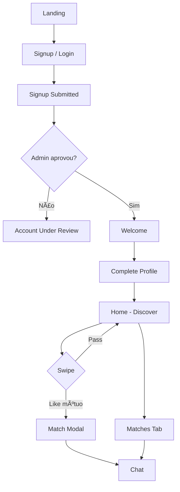

# Unio — Estrutura Front / Back / Database

> Documento de referência arquitetural. Inspirado no **Tinder** (UX de dating) e no **CatholicMatch** (perfil de fé, moderação, intenção matrimonial).  
> Alinhado às decisões: **Brasil primeiro**, **mobile/web (PWA)**, **Firebase**, **monetização depois do MVP**.

---

## 1. Referências e o que cada uma traz

| Referência | O que copiamos | O que adaptamos para o Unio |
|------------|----------------|-------------------------------------|
| **Tinder** | Swipe (like/pass), deck de cards, match mútuo, chat pós-match, filtros de idade/distância, bottom tabs (Discover / Matches / Chat / Profile) | Sem foco em hookup; perfil de fé visível no card; aprovação manual antes de entrar no app |
| **CatholicMatch** | Campos católicos (missa, sacramentos, paróquia, espiritualidade), intenção de casamento sacramental, moderação/admin, certificado de batismo (opcional) | UX mais moderna e mobile-first; fluxo Tinder em vez de browse/listagem; contexto brasileiro (PT-BR, dioceses BR) |

---

## 2. Visão geral da arquitetura

```
Unio-MVP/
├── backend/                    # API Go + Gin (regras de negócio no servidor)
│   ├── cmd/api/                # Entry point
│   └── internal/
│       ├── config/
│       ├── models/             # Entidades de domínio
│       ├── repositories/       # Firestore + Storage
│       ├── services/           # Matching, swipe, chat, moderação
│       ├── handlers/           # HTTP REST
│       └── middleware/         # Auth Firebase JWT, admin, rate limit
│
├── frontend-app/               # Next.js 14 — PWA mobile-first (app principal)
│   ├── app/                    # App Router
│   ├── components/             # UI compartilhada (shadcn/ui)
│   ├── features/               # Módulos por domínio
│   ├── lib/                    # Firebase client, API client
│   └── public/                 # manifest PWA, ícones
│
├── frontend-admin/             # Next.js — moderação (fase 2)
│   └── app/
│       ├── users/              # Aprovar/rejeitar perfis
│       ├── reports/            # Denúncias
│       └── analytics/          # Métricas básicas
│
├── firebase/                   # Config infra Firebase
│   ├── firestore.rules
│   ├── storage.rules
│   └── indexes.json
│
├── docs/
│   ├── AI_DEV_DIRECTIVE.md
│   ├── PLANO_MVP.md
│   └── ARQUITETURA_FIRESTORE.md
│
└── prompts/                    # Implementação faseada (estilo Imobiliária)
    ├── 01_foundation_auth_profile.txt
    ├── 02_discovery_swipe_match.txt
    ├── 03_chat_realtime.txt
    └── 04_moderation_admin.txt
```

### Stack

| Camada | Tecnologia | Motivo |
|--------|------------|--------|
| Auth | Firebase Authentication | Email/senha + Google (Apple depois) |
| Banco | Firestore | Realtime nativo, escala, já familiar do Imobiliária |
| Fotos / docs | Firebase Storage | Fotos de perfil + certificado de batismo |
| Push | Firebase Cloud Messaging (FCM) | Match novo, mensagem nova |
| API | Go + Gin → Cloud Run | Regras anti-fraude, matching, moderação |
| App | Next.js 14 + TypeScript + shadcn/ui + Tailwind | PWA instalável no celular |
| Estado | TanStack Query + Zustand | Cache de API + estado local de UI |
| Deploy | Vercel (front) + Cloud Run (back) | Mesmo padrão do Imobiliária |

---

## 3. Frontend — estrutura e telas

### 3.1 Organização de pastas (`frontend-app`)

```
frontend-app/
├── app/
│   ├── (public)/               # Sem auth
│   │   ├── page.tsx            # Landing
│   │   ├── login/
│   │   ├── signup/
│   │   └── reset-password/
│   │
│   ├── (onboarding)/           # Auth, perfil incompleto
│   │   ├── signup-submitted/
│   │   ├── account-under-review/
│   │   ├── welcome/
│   │   └── complete-profile/
│   │
│   └── (app)/                  # Usuário aprovado — shell com bottom tabs
│       ├── home/               # Discover (swipe) — equivalente Tinder
│       ├── matches/
│       ├── chat/
│       │   └── [matchId]/
│       ├── profile/
│       │   └── edit/
│       ├── settings/
│       │   ├── personal-info/
│       │   ├── privacy-security/
│       │   └── change-password/
│       └── support/
│
├── features/
│   ├── auth/                   # AuthProvider, hooks, guards
│   ├── profile/                # CRUD perfil + fé + fotos
│   ├── discover/               # Deck de cards, swipe gestures
│   ├── matches/                # Lista de matches
│   ├── chat/                   # Mensagens realtime
│   ├── settings/               # Preferências, block
│   └── location/               # Geolocalização + sync
│
├── components/
│   ├── ui/                     # shadcn
│   ├── BottomTabs.tsx          # Home | Matches | Chat | Profile
│   ├── ProfileCard.tsx         # Card estilo Tinder
│   ├── SwipeDeck.tsx
│   └── MatchModal.tsx          # "It's a Match!"
│
├── lib/
│   ├── firebase.ts
│   ├── api-client.ts           # Chamadas ao backend Go
│   └── geo.ts
│
└── routes/
    └── RouteGuards.tsx         # PublicOnly, RequireAuth, RequireApproved
```

### 3.2 Mapa de rotas (já existente no projeto atual → alvo)

| Rota atual (Vite) | Rota alvo (Next.js) | Referência | Descrição |
|-------------------|---------------------|------------|-----------|
| `/` | `/` | CatholicMatch | Landing pública |
| `/login` | `/login` | — | Login |
| `/signup` | `/signup` | CatholicMatch | Cadastro + upload certificado batismo |
| `/signup-submitted` | `/signup-submitted` | CatholicMatch | Confirmação pós-cadastro |
| `/account-under-review` | `/account-under-review` | CatholicMatch | Aguardando aprovação admin |
| `/welcome` | `/welcome` | — | Boas-vindas pós-aprovação |
| `/complete-profile` | `/complete-profile` | CatholicMatch | Onboarding fé + fotos + preferências |
| `/home` | `/home` | **Tinder** | Discover — swipe like/pass |
| `/matches` | `/matches` | **Tinder** | Lista de matches |
| `/chat` | `/chat`, `/chat/[matchId]` | **Tinder** | Conversas |
| `/profile` | `/profile` | Ambos | Ver próprio perfil |
| `/profile/editprofile` | `/profile/edit` | CatholicMatch | Editar perfil + fé |
| `/settings/*` | `/settings/*` | Ambos | Configurações |
| `/admin` | `frontend-admin` | CatholicMatch | Painel moderação (separado) |

### 3.3 Fluxo de navegação (estilo Tinder)



### 3.4 Componentes-chave por feature

**Discover (Tinder)**
- Deck de cards com foto, nome, idade, distância, badges de fé
- Gestos: swipe direita (like), esquerda (pass), botões fallback
- Filtros: idade min/max, distância km, gênero de interesse
- Infinite scroll / paginação de candidatos

**Perfil (CatholicMatch)**
- Dados pessoais: nome, nascimento, gênero, bio, cidade/estado
- Dados de fé: paróquia, tipo de igreja, espiritualidade, frequência missa/confissão/leitura bíblia, santo de devoção
- Fotos: 1 principal + até 3 na galeria
- Preferências: idade, distância, casamento sacramental, filhos

**Chat (Tinder)**
- Lista de conversas ordenada por última mensagem
- Thread realtime (Firestore listener ou polling via API)
- Indicador de lido/não lido
- Block/report inline

---

## 4. Backend — estrutura e responsabilidades

### 4.1 Organização (`backend/internal`)

```
backend/internal/
├── config/
│   └── config.go               # Env: Firebase, port, CORS
│
├── models/
│   ├── user.go
│   ├── profile.go
│   ├── faith_profile.go
│   ├── swipe.go                # Swipe, Match, Conversation, Message
│   ├── block.go
│   ├── report.go
│   └── enums.go
│
├── repositories/
│   ├── user_repo.go
│   ├── profile_repo.go
│   ├── faith_profile_repo.go
│   ├── swipe_repo.go
│   ├── match_repo.go
│   ├── message_repo.go
│   └── geo_repo.go             # Queries por geohash
│
├── services/
│   ├── auth_service.go         # Valida Firebase token
│   ├── profile_service.go
│   ├── discovery_service.go    # Quem aparece no deck
│   ├── swipe_service.go        # Like/pass + detecta match mútuo
│   ├── match_service.go
│   ├── chat_service.go
│   ├── moderation_service.go   # Aprovar/rejeitar/suspender
│   └── notification_service.go # FCM
│
├── handlers/
│   ├── auth_handler.go
│   ├── profile_handler.go
│   ├── discover_handler.go
│   ├── swipe_handler.go
│   ├── match_handler.go
│   ├── message_handler.go
│   ├── block_handler.go
│   ├── report_handler.go
│   └── admin_handler.go
│
└── middleware/
    ├── auth.go                 # Bearer Firebase JWT
    ├── require_approved.go
    ├── require_admin.go
    └── rate_limit.go
```

### 4.2 Por que API Go além do Firebase direto?

| Operação | Client direto | Via API Go |
|----------|---------------|------------|
| Ler próprio perfil | OK | OK |
| Swipe like/pass | ❌ Frágil | ✅ Valida duplicata, block, status |
| Criar match | ❌ Race condition | ✅ Transação atômica |
| Discovery deck | ❌ Expõe lógica | ✅ Filtra blocks, já vistos, geo |
| Aprovar usuário | ❌ Inseguro | ✅ Só admin |
| Denúncia | Parcial | ✅ Workflow completo |

### 4.3 Endpoints REST (MVP)

```
Auth / Users
  POST   /api/v1/users/bootstrap          # Cria user doc após signup Firebase
  GET    /api/v1/users/me
  PATCH  /api/v1/users/me/status          # admin only

Profile
  GET    /api/v1/profiles/me
  PUT    /api/v1/profiles/me
  POST   /api/v1/profiles/me/photos       # Upload URL assinada Storage
  DELETE /api/v1/profiles/me/photos/:id

Faith Profile
  GET    /api/v1/faith-profiles/me
  PUT    /api/v1/faith-profiles/me

Discovery (Tinder)
  GET    /api/v1/discover                   # Deck paginado
  GET    /api/v1/discover/filters           # Preferências ativas

Swipes
  POST   /api/v1/swipes                     # { to_user_id, action: like|pass|super_like }
  GET    /api/v1/swipes/sent                # Histórico (debug/admin)

Matches
  GET    /api/v1/matches
  GET    /api/v1/matches/:id
  DELETE /api/v1/matches/:id                # Unmatch

Chat
  GET    /api/v1/matches/:id/messages
  POST   /api/v1/matches/:id/messages
  PATCH  /api/v1/matches/:id/messages/:msgId/read

Safety
  POST   /api/v1/blocks
  DELETE /api/v1/blocks/:userId
  POST   /api/v1/reports

Admin (CatholicMatch)
  GET    /api/v1/admin/users/pending
  POST   /api/v1/admin/users/:id/approve
  POST   /api/v1/admin/users/:id/reject
  GET    /api/v1/admin/reports
  PATCH  /api/v1/admin/reports/:id
```

---

## 5. Database — Firestore (schema alvo)

> Migração conceitual do schema Supabase atual (`profiles`, `likes`, `matches`, `messages`, `blocks`, `reports`) para Firestore, mantendo os campos já usados no app.

### 5.1 Coleções principais

```
/users/{userId}
/profiles/{userId}                    # doc id = userId (1:1)
/faith_profiles/{userId}              # doc id = userId (1:1)
/swipes/{swipeId}
/matches/{matchId}
/conversations/{conversationId}
/conversations/{conversationId}/messages/{messageId}
/blocks/{blockId}
/reports/{reportId}
/user_roles/{userId}                  # admin | user
/discovery_index/{geohash}/users/{userId}   # índice geo (opcional, fase 2)
```

### 5.2 Documento: `users/{userId}`

```json
{
  "email": "maria@email.com",
  "role": "user",
  "status": "pending | approved | rejected | suspended",
  "onboarding_completed": false,
  "rejection_reason": null,
  "created_at": "timestamp",
  "updated_at": "timestamp",
  "last_active_at": "timestamp"
}
```

**Origem:** `auth.users` + `user_roles` + `profiles.status` (Supabase atual)

### 5.3 Documento: `profiles/{userId}`

```json
{
  "user_id": "uid",
  "first_name": "Maria",
  "last_name": "Silva",
  "display_name": "Maria, 28",
  "gender": "female",
  "date_of_birth": "1998-03-15",
  "age": 28,
  "bio": "Católica praticante...",
  "profile_photo_url": "gs://...",
  "gallery_photos": ["url1", "url2"],
  "location": {
    "latitude": -23.55,
    "longitude": -46.63,
    "geohash": "6gyf4",
    "city": "São Paulo",
    "state": "SP"
  },
  "preferences": {
    "min_age": 25,
    "max_age": 35,
    "max_distance_km": 50,
    "gender_interest": ["male"]
  },
  "marital_status": "Solteira",
  "education_level": "Ensino superior completo",
  "interests": ["música", "voluntariado"],
  "is_discoverable": true,
  "show_distance": true,
  "show_age": true,
  "profile_completed": true,
  "created_at": "timestamp",
  "updated_at": "timestamp"
}
```

**Origem:** tabela `profiles` Supabase + campos de `sync_profiles_schema`

### 5.4 Documento: `faith_profiles/{userId}`

```json
{
  "user_id": "uid",
  "parish": "Paróquia São José",
  "church_type": "Paroquia",
  "spirituality": "Mariana",
  "devotion_saint": "Nossa Senhora de Fátima",
  "mass_frequency_display": "Semanalmente",
  "confession_frequency_display": "Mensalmente",
  "bible_reading_frequency_display": "Diariamente",
  "baptism_certificate_url": "gs://baptism-certificates/...",
  "wants_children": true,
  "open_to_sacramental_marriage": true,
  "faith_tags": ["adoracao", "terço"],
  "created_at": "timestamp",
  "updated_at": "timestamp"
}
```

**Origem:** colunas católicas do `profiles` Supabase, separadas para clareza (padrão CatholicMatch)

### 5.5 Documento: `swipes/{swipeId}`

```json
{
  "id": "auto",
  "from_user_id": "uid_a",
  "to_user_id": "uid_b",
  "action": "like | pass | super_like",
  "created_at": "timestamp"
}
```

**Índices compostos:**
- `(from_user_id, created_at DESC)` — histórico
- `(from_user_id, to_user_id)` — UNIQUE lógico (via API)

**Origem:** tabela `likes` Supabase (+ `pass` que hoje não persiste — adicionar no Firestore)

### 5.6 Documento: `matches/{matchId}`

```json
{
  "id": "auto",
  "user_ids": ["uid_a", "uid_b"],
  "created_at": "timestamp",
  "last_message_at": "timestamp",
  "last_message_preview": "Oi! Tudo bem?"
}
```

**Origem:** tabela `matches` Supabase (`user1_id`, `user2_id` → `user_ids` ordenados)

**Regra de negócio (Tinder):** criado automaticamente quando existe like mútuo (equivalente ao trigger `check_mutual_like()` do Supabase).

### 5.7 Subcoleção: `conversations/{id}/messages/{messageId}`

```json
{
  "id": "auto",
  "conversation_id": "match_id",
  "sender_id": "uid",
  "text": "Olá!",
  "created_at": "timestamp",
  "read_at": null
}
```

**Origem:** tabela `messages` Supabase (`read_status` → `read_at`)

**Realtime:** Firestore `onSnapshot` na subcoleção (equivalente ao `supabase_realtime` atual)

### 5.8 Documentos: `blocks` e `reports`

```json
// blocks/{blockId}
{
  "blocker_id": "uid",
  "blocked_id": "uid",
  "created_at": "timestamp"
}

// reports/{reportId}
{
  "reporter_id": "uid",
  "reported_id": "uid",
  "reason": "spam",
  "details": "...",
  "status": "open | reviewed | closed",
  "admin_notes": null,
  "created_at": "timestamp"
}
```

### 5.9 Firebase Storage — buckets

| Bucket | Público | Uso | Origem Supabase |
|--------|---------|-----|-----------------|
| `profile-photos` | Sim | Fotos de perfil e galeria | `profile-photos` |
| `baptism-certificates` | Não | Certificado de batismo (moderação) | `baptism-certificates` |

Estrutura de path: `{userId}/{filename}`

### 5.10 Índices Firestore recomendados

```
profiles:    is_discoverable ASC, gender ASC, age ASC
profiles:    location.geohash ASC, is_discoverable ASC
swipes:      from_user_id ASC, to_user_id ASC
swipes:      from_user_id ASC, created_at DESC
matches:     user_ids ARRAY_CONTAINS, last_message_at DESC
messages:    conversation_id ASC, created_at ASC
reports:     status ASC, created_at DESC
users:       status ASC, created_at ASC
```

### 5.11 Geo / distância (Brasil)

Firestore não tem PostGIS. Estratégia MVP:

1. Salvar `lat/lng` + `geohash` (precisão ~5 = ~5 km)
2. Query por prefixos de geohash adjacentes
3. Filtrar distância exata no backend Go (Haversine)
4. Campo `preferences.max_distance_km` (já existe como `distance_max` no Supabase)

---

## 6. Regras de segurança (Firestore + Storage)

### Princípios

- Client **lê** mensagens do próprio match (realtime)
- Client **não escreve** swipes, matches, aprovações — só via API Go
- Admin via custom claims Firebase (`role: admin`)
- Certificado de batismo: leitura só owner + admin

### Status do usuário (CatholicMatch → Unio)

```
pending   → cadastrou, aguarda admin
approved  → pode usar discover/chat
rejected  → cadastro recusado (motivo em rejection_reason)
suspended → ban temporário/permanente
```

Route guard `RequireApproved` no frontend bloqueia acesso ao app até `status === approved`.

---

## 7. Mapeamento: projeto atual → arquitetura alvo

| Hoje (Downloads/faith-match-main) | Alvo |
|-----------------------------------|------|
| Vite + React Router | Next.js 14 App Router + PWA |
| Supabase Auth | Firebase Auth |
| Supabase Postgres | Firestore |
| Supabase Storage | Firebase Storage |
| Supabase Realtime (messages) | Firestore onSnapshot |
| Lógica no client + RLS | Client + API Go |
| `likes` table | `swipes` collection (like + pass) |
| `profiles` monolítico | `profiles` + `faith_profiles` |
| `/admin` no mesmo app | `frontend-admin` separado |
| Features: auth, profile | + discover, matches, chat, settings |

### Modelos Go já iniciados (Projects/faith-match)

Estes arquivos já definem o contrato alvo do backend:

- `models/user.go` — User, status, role
- `models/profile.go` — Profile, GeoLocation, DiscoveryPreferences
- `models/faith_profile.go` — campos católicos migrados do Supabase
- `models/swipe.go` — Swipe, Match, Conversation, Message, Block, Report
- `models/enums.go` — Gender, SwipeAction, ChurchType, Spirituality, etc.

---

## 8. MVP — fases de implementação

### Fase 1 — Fundação (2–3 semanas)
- [ ] Firebase project (Auth, Firestore, Storage)
- [ ] Backend Go: bootstrap user, profile, faith_profile
- [ ] Frontend: landing, signup, login, guards
- [ ] Upload fotos + certificado batismo
- [ ] Admin: fila de aprovação básica

### Fase 2 — Core Tinder (2–3 semanas)
- [ ] Discovery deck + swipe API
- [ ] Match mútuo automático
- [ ] Lista de matches
- [ ] Filtros idade/distância/gênero
- [ ] Block básico

### Fase 3 — Chat (1–2 semanas)
- [ ] Mensagens realtime
- [ ] FCM: novo match, nova mensagem
- [ ] Report/denúncia

### Fase 4 — Polish (1 semana)
- [ ] PWA manifest + ícones
- [ ] UX mobile (gestos, animações)
- [ ] Landing SEO PT-BR

### Fora do MVP
- Pagamentos / premium (CatholicMatch tem assinatura)
- Super like / boost (Tinder monetiza)
- Verificação de identidade
- Videochamada
- Integração paróquias/dioceses

---

## 9. Diferenciais Unio vs Tinder puro

| Feature | Tinder | Unio |
|---------|--------|-------------|
| Aprovação manual | Não | Sim (CatholicMatch) |
| Perfil de fé | Não | Sim — missa, sacramentos, paróquia |
| Certificado batismo | Não | Opcional no cadastro |
| Intenção matrimonial | Opcional | Campo explícito |
| Público | Geral | Católicos — Brasil primeiro |
| Idioma | Global | PT-BR nativo |

---

## 10. Próximos passos sugeridos

1. Validar este documento (campos de perfil, fluxo de aprovação, rotas)
2. Criar projeto Firebase (`unio-mvp-br` ou similar)
3. Scaffold `frontend-app` Next.js PWA migrando páginas do Vite
4. Completar backend Go (repositories + handlers + services)
5. Script de migração Supabase → Firestore (se quiser preservar dados de teste)

---

*Gerado com base no projeto existente em `Downloads/faith-match-main`, modelos Go em `Projects/faith-match`, padrão arquitetural do repositório Imobiliária, e referências Tinder + CatholicMatch.*

